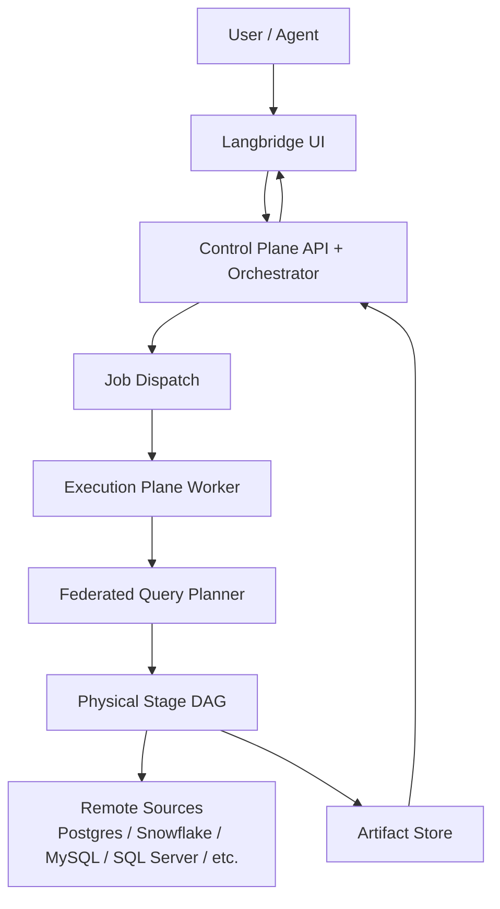

# Langbridge

Langbridge is **agentic analytics infrastructure** with a **distributed federated query engine**.

It is built for teams that need:
- AI agents that can reason across data systems.
- Native SQL authoring and execution in product.
- Semantic modeling for governed analytics.
- Hybrid execution across hosted and customer runtimes.

Langbridge is not a standalone BI suite and not a SQL proxy. It is a control-and-execution platform for agentic analytics workloads.

## What Is Langbridge?

Langbridge provides a unified runtime for:
- **Semantic** workloads (structured semantic query model).
- **SQL** workloads (UI-native SQL workbench and saved SQL artifacts).
- **AI agent** workflows (planner/supervisor/tool orchestration).

All heavy query execution happens through the Worker execution plane and federated planner/executor pipeline.

## Architecture Overview

- **Control Plane** (`langbridge/apps/api`, `client/`):
  API, orchestration, auth, tenancy, policies, runtime registry, and UI.
- **Execution Plane** (`langbridge/apps/worker`):
  Worker runtime, connectors, secrets resolution, job handlers, message consumption.
- **Federated Query Engine** (`langbridge/packages/federation`):
  Logical planning, optimization, physical stage DAG generation, stage scheduling/execution.

More architecture docs:
- `docs/architecture/overview.md`
- `docs/architecture/control-plane.md`
- `docs/architecture/execution-plane.md`
- `docs/architecture/federated-query-engine.md`
- `docs/architecture/hybrid-deployment.md`
- `docs/architecture/deprecations.md`

## Federated Query Engine

Primary structured query execution now uses the built-in federated engine in `langbridge/packages/federation` and Worker tooling in `langbridge/apps/worker/langbridge_worker/tools/federated_query_tool.py`.

Core capabilities:
- SQL and semantic query planning.
- Predicate/projection pushdown.
- Join strategy selection and stage DAG planning.
- Local and distributed stage execution adapters.
- Artifact-backed results and execution summaries.

## SQL Feature

Langbridge includes a first-class SQL workbench UI under `/sql`:
- Native SQL editor with dialect controls (default T-SQL / connector dialect).
- Single-source execution and federated mode.
- Schema browsing, params, explain, history, and saved queries.
- Worker-enforced limits (rows, runtime, exports) and policy bounds.
- Job lifecycle support including cancel for queued/running jobs.

Reference:
- `docs/features/sql.md`

## Hybrid Deployment

Langbridge supports:
- **Hosted mode**: control plane and workers run in Langbridge-managed infrastructure.
- **Hybrid mode**: control plane hosted; execution plane runs in customer runtime.
- **Self-hosted mode**: customer operates control + execution in their own environment.

Secure runtime registration is handled via `/api/v1/runtimes/*` and edge task transport endpoints `/api/v1/edge/tasks/*`.

Reference:
- `docs/deployment/hosted.md`
- `docs/deployment/hybrid.md`
- `docs/deployment/self-hosted.md`

## Getting Started

### Local (core stack)
- API: `uvicorn langbridge.apps.api.langbridge_api.main:app --reload`
- Worker: `python -m langbridge.apps.worker.langbridge_worker.main`
- UI: `cd client && npm install && npm run dev`

### Docker (core services only)
- `docker compose up --build migrate api worker client db redis`
- UI: `http://localhost:3000`
- API docs: `http://localhost:8000/docs`

## Development

Developer docs:
- `docs/development/local-dev.md`
- `docs/development/worker-dev.md`
- `docs/api.md`
- `docs/features/semantic.md`
- `docs/features/federation.md`
- `docs/features/agents.md`

## Roadmap

- Expand federated join strategies and planner heuristics.
- Improve cost-based optimization and statistics feedback loops.
- Add runtime autoscaling and placement policies for customer runtimes.
- Continue SQL workbench UX improvements (profiling, collaboration, governance workflows).
