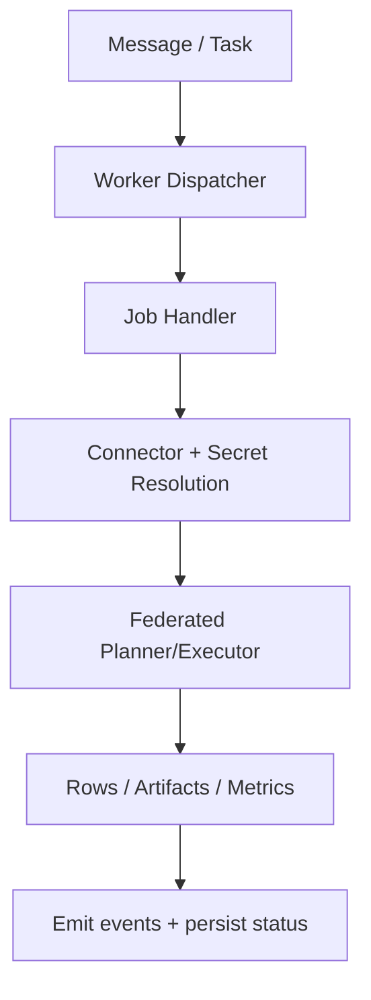

# Execution Plane

The Execution Plane is where workloads run. In Langbridge this is the Worker runtime.

## Responsibilities

- Consume queued messages/jobs.
- Resolve connector secrets and instantiate connectors.
- Execute semantic and SQL job handlers.
- Run federated query planning/execution pipeline.
- Enforce runtime constraints (timeouts, limits, retries, cancellation best-effort).
- Emit result artifacts and execution metadata.

## Main Components

- Worker runtime: `langbridge/apps/runtime_worker/main.py`
- Message dispatcher: `langbridge/apps/runtime_worker/handlers/dispatcher.py`
- SQL job handler: `langbridge/apps/runtime_worker/handlers/query/sql_job_request_handler.py`
- Semantic query handler: `langbridge/apps/runtime_worker/handlers/query/semantic_query_request_handler.py`
- Federated tool integration: `langbridge/packages/runtime/execution/federated_query_tool.py`

## Execution Modes

- **Hosted mode**: workers consume jobs from internal broker.
- **Customer runtime mode**: workers use edge task pull/ack/result/fail transport to execute in customer-managed infrastructure.

## Connector and Secret Boundary

- Connector configs are resolved at execution time.
- Secrets are fetched through secret provider registry.
- Plaintext secrets are not returned to UI clients.
- Execution isolation is enforced by workspace and runtime routing policies.

## Worker Lifecycle

