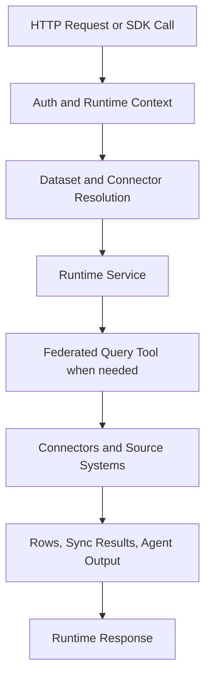

# Execution Plane

The execution plane is where Langbridge runtime requests actually run.

Today that means the configured runtime host plus the runtime services it composes.

The current execution plane should be read as single-node first. There are dispatch seams that can support later coordinator/worker scale-out, but those are preview-oriented internals rather than the primary v1 packaging story.

## Responsibilities

- build a runtime context for each request
- resolve datasets, connectors, semantic models, and secrets
- execute dataset preview, SQL, semantic, sync, and agent workloads
- route structured work through federation when needed
- enforce runtime limits, redaction, and guardrails
- return rows, summaries, artifacts, and sync state

## Main Components

- host API: `langbridge/runtime/hosting/app.py`
- host auth: `langbridge/runtime/hosting/auth.py`
- runtime host facade: `langbridge/runtime/services/runtime_host.py`
- dataset query service: `langbridge/runtime/services/dataset_query_service.py`
- SQL query service: `langbridge/runtime/services/sql_query_service.py`
- semantic query service: `langbridge/runtime/services/semantic_query_execution_service.py`
- connector sync runtime: `langbridge/runtime/services/dataset_sync_service.py`
- agent execution service: `langbridge/runtime/services/agent_execution_service.py`
- federated execution bridge: `langbridge/runtime/execution/federated_query_tool.py`
- federated engine: `langbridge/federation/*`
- MCP assembly: `langbridge/mcp/server.py`
- packaged UI serving: `langbridge/ui/server.py`

## Execution Modes

- Embedded runtime: `LangbridgeClient.local(...)` or direct runtime composition
- Self-hosted runtime host: `langbridge serve --config ...`
- Host with UI: `langbridge serve --config ... --features ui`
- Host with MCP: `langbridge serve --config ... --features mcp`

The current HTTP host serves configured local runtimes in this release.

## Request Lifecycle

