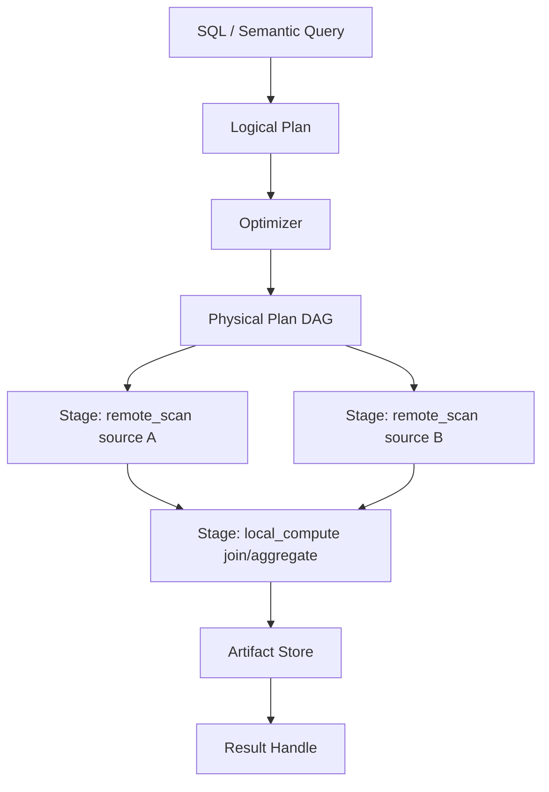

# Federated Query Engine

The Federated Query Engine is Langbridge's primary structured data engine.

It replaces the old dependency on a Trino-based data plane and runs through Worker execution.

The engine now consumes normalized dataset execution descriptors as its primary structured input abstraction.

- database tables
- uploaded csv/parquet/json datasets
- parquet-backed SaaS/API syncs such as Shopify
- virtual datasets
- future structured third-party connectors

If a dataset advertises structured scan plus SQL federation support, it can participate in runtime joins through this same worker pipeline.

## Engine Components

- Service facade: `langbridge/packages/federation/service.py`
- Planner: `langbridge/packages/federation/planner/planner.py`
- SQL parser/compiler:
  - SQL logical planning: `langbridge/packages/federation/planner/parser.py`
  - Semantic compilation: `langbridge/packages/federation/planner/smq_compiler.py`
- Optimizer: `langbridge/packages/federation/planner/optimizer.py`
- Physical planning: `langbridge/packages/federation/planner/physical_planner.py`
- Scheduler/executor:
  - `langbridge/packages/federation/executor/scheduler.py`
  - `langbridge/packages/federation/executor/stage_executor.py`
  - `langbridge/packages/federation/executor/artifact_store.py`

## Query Lifecycle

1. SQL or semantic query enters via API and is dispatched to worker.
2. Worker resolves dataset descriptors into workspace workflow bindings and source adapters.
3. Planner produces logical plan and optimized physical stage DAG.
4. Scheduler executes remote and local stages with retry and artifact reuse.
5. Result handle, artifacts, stage metrics, and stats are returned.

## Federated Execution DAG

## Planner and Cost Direction

Current implementation supports:
- Pushdown of scans/filters/projections where possible.
- Join strategy decisions informed by statistics heuristics.
- Stage-level retries and artifact-backed idempotence.
- Dataset-oriented relation identity resolution for mixed structured sources.
- DuckDB-backed local execution for file/parquet sources alongside SQL connector sources.

Roadmap focus:
- Better cost model and stats feedback.
- Richer distributed dispatch integration.
- Additional join and repartition strategies.
