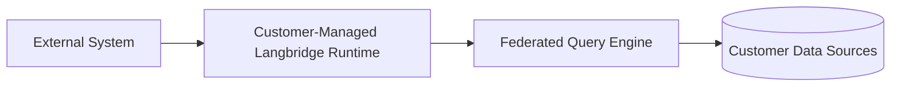

# Hybrid Deployment

Hybrid deployment means Langbridge runtime execution stays in customer-managed infrastructure while still integrating with external systems.

## Core Idea

- the runtime stays close to the data
- connectors and secrets stay on the runtime side
- external coordination happens through explicit runtime-owned APIs and adapters

## Boundary

The runtime repo owns:

- runtime host execution
- workspace-scoped runtime identity
- runtime-owned ports for datasets, connectors, semantic models, sync state, MCP, and UI serving

External systems may provide:

- registration
- coordination
- metadata population
- automation or operator workflows

Those systems should not redefine runtime-core identity or pull connector access out of the runtime boundary.

## Topology

