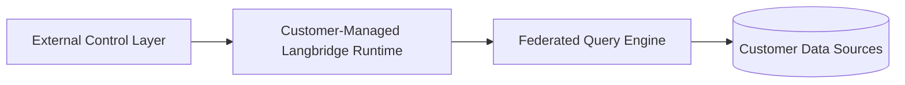

# Hybrid Deployment

Hybrid deployment means Langbridge runtime execution stays in customer-managed
infrastructure while still integrating with an external control layer.

## Core Idea

- the runtime stays close to the data
- connectors and secrets stay on the runtime side
- external coordination happens through explicit runtime-owned contracts

## Boundary

The runtime repo owns:

- runtime host and worker execution
- workspace-scoped runtime identity
- runtime-owned ports for datasets, connectors, semantic models, and sync state

An external control layer may provide:

- registration
- coordination
- metadata population
- hosted operator UX

But that control layer should not redefine runtime-core identity or pull
connector access into the cloud side.

## Topology

