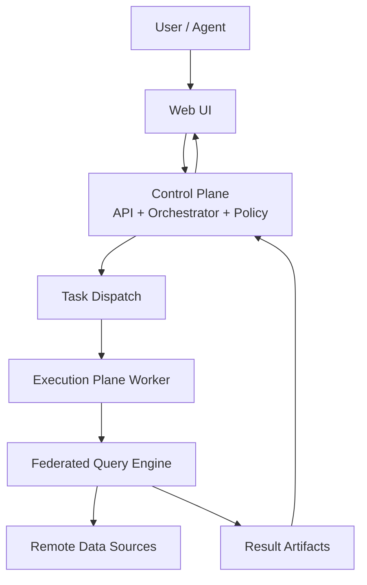
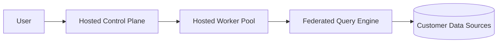
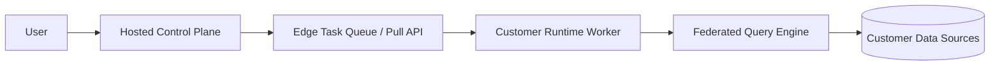

# Architecture Overview

Langbridge is **Agentic Analytics Infrastructure with a Distributed Federated Query Engine**.

It is organized into three runtime domains:
- **Control Plane**: SaaS/API/UI/orchestration/policy and runtime registry.
- **Execution Plane**: Worker runtime where jobs execute with connector access.
- **Federated Query Engine**: planner + optimizer + stage executor used by workers.

## Primary System Flow

## Hosted Mode

In hosted mode, Langbridge operates both control and execution planes.

## Hybrid Mode

In hybrid mode, the control plane is hosted while worker runtime executes in customer infrastructure.

## Core Principles

- All structured query execution is Worker-mediated.
- SQL and semantic workloads share a common federated planning and execution substrate.
- Control plane and execution plane are independently deployable.
- Runtime registration and edge task transport are authenticated and auditable.
- External SQL gateway and Trino infrastructure are no longer part of the release architecture.

## Related Docs

- `docs/architecture/control-plane.md`
- `docs/architecture/execution-plane.md`
- `docs/architecture/federated-query-engine.md`
- `docs/architecture/hybrid-deployment.md`
- `docs/architecture/deprecations.md`
