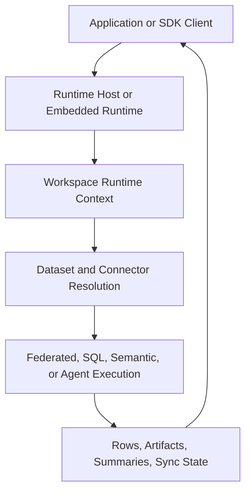

# Architecture Overview

Langbridge is the runtime half of the Langbridge product split.

- `langbridge/` owns runtime execution and self-hosted runtime product surfaces
- `langbridge-cloud/` owns the hosted control plane and cloud product surfaces

Inside this repo, the runtime is a single Python package with internal modules,
not the old multi-package layout.

## Main Runtime Modules

- `langbridge.runtime`: runtime context, host construction, auth, services, providers
- `langbridge.connectors`: connector implementations
- `langbridge.plugins`: connector registry and extension surface
- `langbridge.semantic`: semantic model contracts and loaders
- `langbridge.federation`: federated planning and execution
- `langbridge.orchestrator`: agent and tool orchestration
- `langbridge.client`: SDK for local, self-hosted, and remote access

## Primary Runtime Flow

## Execution Identity

Runtime execution is workspace-scoped. The core identity carried through the
runtime is:

- `workspace_id`
- `actor_id`
- `roles`
- `request_id`

External product identity concepts are not runtime-core execution identity in
this repository.

## Self-Hosted Product Surface

The self-hosted runtime host wraps a configured local runtime and serves
runtime-owned HTTP endpoints. It currently supports thin auth modes:

- `none`
- `static_token`
- `jwt`

The worker remains available as a thin queued or edge execution assembly where
needed.
