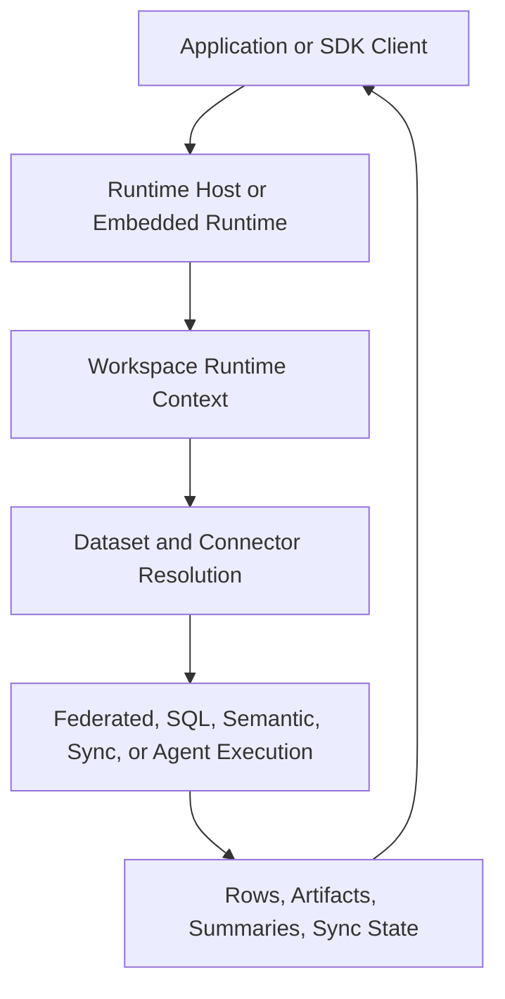

# Architecture Overview

Langbridge is a runtime monolith with one primary public surface: the runtime host.

Inside this repo, the runtime is a single Python package with internal module boundaries, plus a React app that builds into the packaged runtime UI bundle.

## Main Runtime Modules

- `langbridge.runtime`: runtime context, host construction, auth, services, providers
- `langbridge.connectors`: connector implementations
- `langbridge.plugins`: connector registry and extension surface
- `langbridge.semantic`: semantic model contracts and loaders
- `langbridge.federation`: federated planning and execution
- `langbridge.orchestrator`: agent and tool orchestration
- `langbridge.client`: SDK for local and runtime-host access
- `langbridge.mcp`: MCP server assembly
- `langbridge.ui`: packaged runtime UI

## Primary Runtime Flow

## Execution Identity

Runtime execution is workspace-scoped. The core identity carried through the runtime is:

- `workspace_id`
- `actor_id`
- `roles`
- `request_id`

## Self-Hosted Product Surface

The self-hosted runtime host wraps a configured local runtime and serves runtime-owned HTTP endpoints. It supports thin auth modes:

- `none`
- `static_token`
- `jwt`

Feature-gated surfaces can be mounted on the same host:

- `ui`
- `mcp`
