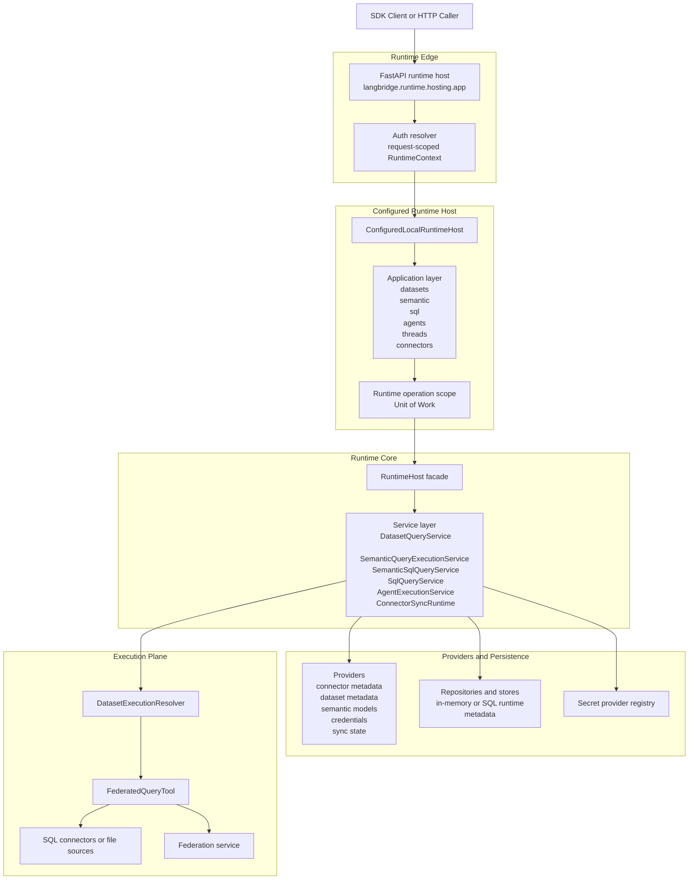
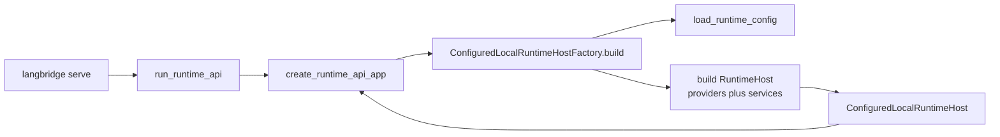
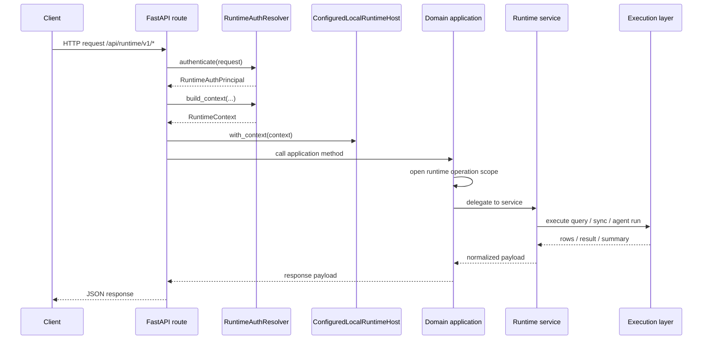
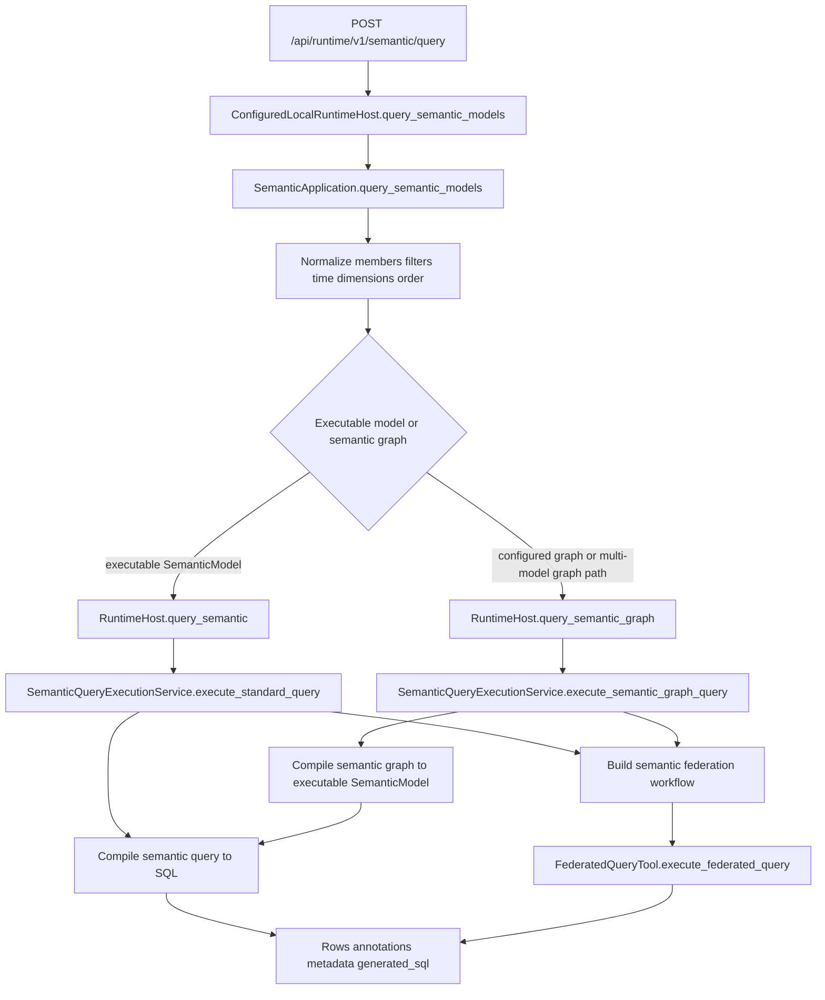
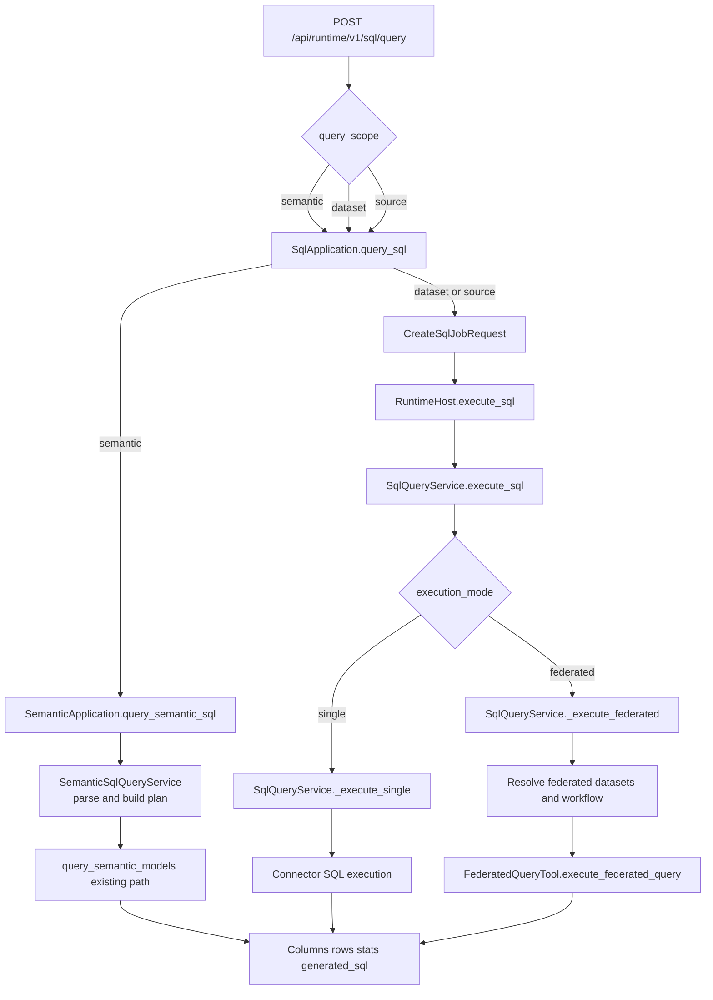
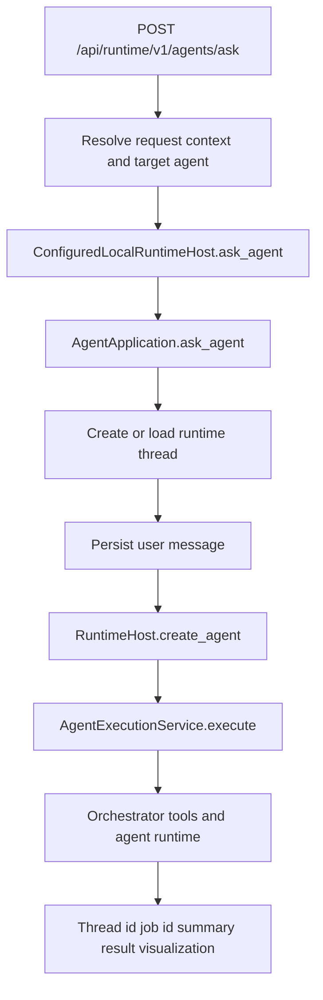
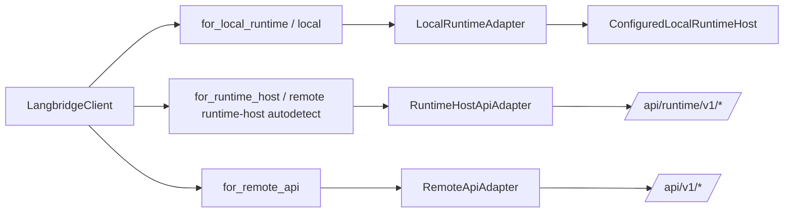

# Runtime API Layering

These diagrams describe the current `langbridge/` runtime shape as implemented in the repo today.

## High-Level Layering



## Bootstrap To Runtime Host



## Request Path Through The API



## Dataset Preview Flow

```mermaid
flowchart TD
    Route[POST /api/runtime/v1/datasets/{dataset_ref}/preview]
    Resolve[Resolve dataset id and request context]
    Host[ConfiguredLocalRuntimeHost.query_dataset]
    App[DatasetApplication.query_dataset]
    Service[DatasetQueryService._run_preview]
    Bundle[Load dataset, columns, policy]
    Workflow[DatasetExecutionResolver.build_workflow_for_dataset]
    SQL[Build preview SQL with filters and row policy]
    Federated[FederatedQueryTool.execute_federated_query]
    Result[Apply redaction and shape preview response]

    Route --> Resolve
    Resolve --> Host
    Host --> App
    App --> Service
    Service --> Bundle
    Bundle --> Workflow
    Workflow --> SQL
    SQL --> Federated
    Federated --> Result
```

## Semantic Query Flow



## SQL Query Flow



## Agent Ask Flow



## SDK Access Modes


