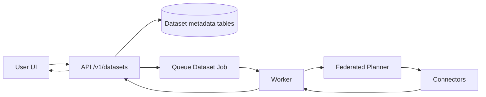
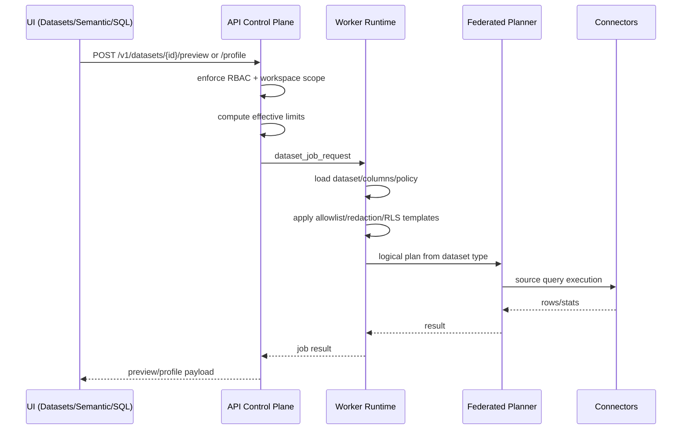

# Datasets

Datasets are the common structured data contract in Langbridge.

- Connectors expose raw physical sources.
- Datasets define reusable technical contracts over those sources, regardless of origin.
- Semantic models provide business meaning on top of datasets.
- SQL workbench, semantic execution, and agents all resolve structured execution through dataset descriptors first.

## Why Datasets Exist

Datasets solve control-plane and runtime concerns that should not live in semantic models:

- normalized source contract (`source_kind`, `connector_kind`, `storage_kind`)
- source binding (`connection_id`, table/sql/federated/file metadata)
- governed column allowlist and explicit schema
- preview/export policy enforcement
- row-filter templates and result redaction
- canonical relation identity for federation
- execution capabilities for pushdown/materialization/federation
- execution-oriented revision history and profiling stats

This keeps semantic models focused on business meaning (dimensions, measures, relationships, metrics).

## Data Model

Core records:

- `datasets`
- `dataset_columns`
- `dataset_policies`
- `dataset_revisions`
- `lineage_edges`

Dataset records now carry a normalized execution descriptor:

- `source_kind`: `database | saas | api | file | virtual`
- `connector_kind`: `postgres | mysql | snowflake | shopify | hubspot | csv_upload | parquet_lake | ...`
- `storage_kind`: `table | parquet | csv | json | view | virtual`
- `relation_identity_json`
- `execution_capabilities_json`

This means a Shopify orders sync materialized to parquet is treated as a structured dataset with parquet storage and SQL federation support, not just a generic file.

Indexes:

- `datasets.workspace_id`
- `datasets.name` (with workspace uniqueness)
- `datasets.updated_at`
- `dataset_revisions.dataset_id`
- `dataset_revisions.created_at`
- `lineage_edges.workspace_id`
- `lineage_edges.source_type/source_id`
- `lineage_edges.target_type/target_id`
- composite indexes on `(workspace_id, name)` and `(workspace_id, updated_at)`

## Versioning And Lineage

Datasets are append-only from a governance perspective:

- every create/update/restore writes a new `dataset_revisions` row
- `datasets.revision_id` points at the active revision
- restore is implemented as a new revision created from an older snapshot
- change summaries and `created_by` preserve the audit trail

Each revision stores:

- dataset definition snapshot
- schema snapshot
- policy snapshot
- source binding snapshot
- execution characteristics including relation identity and execution capabilities

Lineage is stored relationally in `lineage_edges` so it can be queried without a separate graph service.

Tracked nodes currently include:

- connections
- source tables
- file resources
- datasets
- semantic models
- unified semantic models
- saved queries
- dashboards

Tracked edge types currently include:

- `FEEDS`
- `DERIVES_FROM`
- `REFERENCES`
- `MATERIALIZES_FROM`
- `GENERATED_BY`

## API Surface

Dataset governance extends the existing `/v1/datasets` surface without introducing `/v2`.

- `GET /v1/datasets/{id}/versions`
- `GET /v1/datasets/{id}/versions/{revision_id}`
- `GET /v1/datasets/{id}/diff?from_revision=...&to_revision=...`
- `POST /v1/datasets/{id}/restore`
- `GET /v1/datasets/{id}/lineage`
- `GET /v1/datasets/{id}/impact`

The existing create and update endpoints now:

- create dataset revisions automatically
- update `datasets.revision_id`
- refresh lineage edges for the dataset definition

Semantic model, unified semantic model, saved query, and dashboard save flows also register lineage edges so downstream impact analysis stays current.

## Execution Architecture

- API persists dataset metadata and dispatches jobs.
- Worker resolves dataset definitions, enforces policy server-side, and executes via federated planner.
- Connector secrets remain in connector/runtime secret stores; datasets only store non-secret metadata.
- Structured datasets are execution-planned through normalized dataset descriptors instead of source-type branching.

### Create Flow

### Execute Preview/Profile Flow

## Capability Model

Execution is controlled by explicit capabilities rather than implicit dataset-type branches:

- `supports_structured_scan`
- `supports_sql_federation`
- `supports_filter_pushdown`
- `supports_projection_pushdown`
- `supports_aggregation_pushdown`
- `supports_join_pushdown`
- `supports_materialization`
- `supports_semantic_modeling`

Current defaults:

- database tables/views: structured scan + federation + pushdown where applicable
- csv/parquet/json structured files: structured scan + federation through DuckDB-backed execution
- virtual datasets: structured scan + federation through dataset composition
- non-structured payloads: materialization-first, no direct SQL federation

## Federation-First Direction

- Database tables, uploaded files, parquet-backed SaaS/API syncs, and virtual datasets are all datasets first.
- If a dataset supports structured federation, the worker planner can join it with other structured datasets at runtime.
- Dataset lineage and revision snapshots remain compatible with the earlier dataset-version work.

## Migration Plan

No breaking changes:

1. Existing semantic models with physical table bindings continue to execute.
2. New semantic models should prefer `dataset_id` in table definitions.
3. Existing semantic models can be migrated incrementally table-by-table.
4. Worker semantic execution supports mixed models (dataset-backed and legacy physical tables).
5. Legacy dataset rows without normalized metadata are backfilled with compatibility defaults and still resolve at runtime.

Recommended direction:

- Treat dataset as mandatory source contract for all new semantic models.
- Keep business semantics in semantic model only; do not duplicate business logic into dataset objects.
